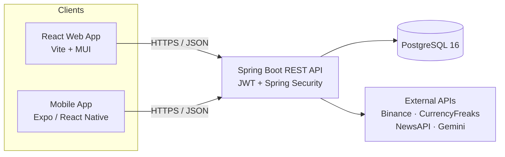

<div align="center">

# CryptoExchange — Crypto & FX Trading Platform

**A full-stack platform for trading cryptocurrencies and fiat currencies, with a web dashboard, a native mobile app, and an admin back office.**

[](#tech-stack)
[](#tech-stack)
[](#tech-stack)
[](#tech-stack)
[](#quick-start)

</div>

---

## Overview

CryptoExchange lets users browse live market rates, place buy/sell orders, and manage their account across **web and mobile**, while administrators handle orders and users from a dedicated panel. Live crypto prices stream from the **Binance** public API, fiat rates come from **CurrencyFreaks**, and a built-in **News** feed is summarized by **Google Gemini**.

- **Real-time pricing** — 15+ cryptocurrencies (BTC, ETH, BNB, SOL, XRP, DOGE, AVAX, MATIC…) priced live, with fiat pairs against PLN.
- **End-to-end ordering** — place orders, track status, and collect them; admins move orders through their lifecycle.
- **One stack, three clients** — a shared Spring Boot API powers the React web app and the Expo mobile app.
- **Secure by default** — JWT auth, BCrypt password hashing, role-based access (USER / ADMIN), secrets kept in environment variables.

## Architecture



| Layer | Technology |
|-------|-----------|
| **Backend** | Spring Boot 3.2 (Java 21), Spring Security (JWT), Spring Data JPA, Flyway, Gradle |
| **Web** | React 18, TypeScript, Vite, Material-UI, Redux Toolkit, React Router, Axios |
| **Mobile** | Expo, React Native, Expo Router, Redux Toolkit, React Native Paper, SecureStore, i18n |
| **Database** | PostgreSQL 16 |
| **Infrastructure** | Docker, Docker Compose, Nginx |
| **External APIs** | Binance (crypto), CurrencyFreaks (fiat), NewsAPI + Google Gemini (news) |

## Features

- **Authentication & roles** — sign up, sign in, token check, persistent sessions; USER and ADMIN roles with route protection.
- **Live crypto market** — real-time prices from Binance with a configurable sell-side discount, plus per-symbol price lookup.
- **Favorites** — users can star and manage their favorite coins.
- **Fiat exchange** — USD, EUR, GBP rates against PLN via CurrencyFreaks.
- **Orders** — create orders, view your own history, and track status; admins list, update status, and mark orders as collected.
- **Admin panel** — manage all orders and active orders from a privileged view.
- **News feed** — latest market news fetched from NewsAPI and summarized by Gemini AI.
- **Mobile-native UX** — secure token storage, geolocation, offline cache, network awareness, haptics, and animations.
- **Internationalization** — multi-language support in the mobile app.

## Quick Start

### Prerequisites

- **Docker** 20.10+ and **Docker Compose** 2.0+
- For the mobile app: **Node.js** 18+ (and Android Studio / Android SDK for an emulator)

### 1. Clone and configure

```bash
git clone https://github.com/ArtsiomDziainekaDev/aplikacja-mobilna.git
cd aplikacja-mobilna
cp .env.example .env   # Windows: copy .env.example .env
```

Fill in `.env` with real values (see [Configuration](#configuration)). Secrets are **never** committed.

### 2. Run the backend, web app, and database

```bash
docker compose up --build
```

| Service | URL |
|---------|-----|
| Web app | http://localhost |
| REST API | http://localhost:8081 |
| Health check | http://localhost:8081/api/health |
| PostgreSQL | localhost:5432 |

### 3. Run the mobile app (optional)

```bash
cd mobile
npm install
cp .env.example .env   # Windows: copy .env.example .env
npx expo start --port 8082 -c
```

Set `EXPO_PUBLIC_API_URL` in `mobile/.env` to match your target:

| Target | Value |
|--------|-------|
| Browser (web) | `http://localhost:8081` |
| Android emulator | `http://10.0.2.2:8081` |
| Physical device (same Wi-Fi) | `http://<YOUR_PC_IP>:8081` |

Then press **a** for the Android emulator, or scan the QR code with **Expo Go**. See [`mobile/POLACZENIE-Z-SERWEREM.md`](mobile/POLACZENIE-Z-SERWEREM.md) for device/network setup details.

## Configuration

Environment variables for the backend stack live in the root `.env` file (consumed by `docker-compose.yml`):

| Variable | Required | Description |
|----------|:--------:|-------------|
| `POSTGRES_PASSWORD` | ✅ | PostgreSQL password |
| `JWT_SECRET` | ✅ | JWT signing key (min. 32 chars) |
| `TESTING_APP_SECRET` | ✅ | Secret used by app tests (min. 64 chars) |
| `JWT_EXPIRATION` | ⬜ | Token lifetime in ms (default `604800000` = 7 days) |
| `CURRENCYFREAKS_APIKEY` | ⬜ | Fiat exchange rates API key |
| `COINMARKETCAP_API_KEY` | ⬜ | Optional crypto data provider key |
| `NEWSAPI_KEY` | ⬜ | Required for the News feature |
| `GEMINI_API_KEY` | ⬜ | Required for AI news summaries |

> The mobile app uses its own `mobile/.env` with a single `EXPO_PUBLIC_API_URL` pointing at the backend.

## API Reference

Base URL: `http://localhost:8081`

### Auth — `/api/auth`
| Method | Endpoint | Description |
|--------|----------|-------------|
| `POST` | `/signup` | Register a new user |
| `POST` | `/signin` | Log in and receive a JWT |
| `GET` | `/check` | Validate the current token |

### Crypto — `/api/crypto`
| Method | Endpoint | Description |
|--------|----------|-------------|
| `GET` | `/` | List supported cryptocurrencies with live prices |
| `GET` | `/{symbol}/price` | Get the price for a single symbol |
| `GET` | `/favorites` | List the user's favorite coins 🔒 |
| `POST` | `/favorites/{symbol}` | Add a coin to favorites 🔒 |
| `DELETE` | `/favorites/{symbol}` | Remove a coin from favorites 🔒 |

### Currencies — `/api/currencies`
| Method | Endpoint | Description |
|--------|----------|-------------|
| `GET` | `/rate` | Exchange rate between two currencies |
| `GET` | `/external-rate` | Alias for the external rate lookup |

### Orders — `/api/orders`
| Method | Endpoint | Description |
|--------|----------|-------------|
| `POST` | `/` | Create an order 🔒 |
| `GET` | `/my` | List the current user's orders 🔒 |
| `GET` | `/` | List all orders 🔑 ADMIN |
| `PUT` | `/{orderId}/status` | Update an order's status 🔑 ADMIN |

### Admin — `/api/admin`
| Method | Endpoint | Description |
|--------|----------|-------------|
| `GET` | `/orders` | List all orders 🔑 ADMIN |
| `GET` | `/active-orders` | List active orders 🔑 ADMIN |
| `PUT` | `/orders/{orderId}/status` | Update order status 🔑 ADMIN |
| `POST` | `/orders/{orderId}/collect` | Mark an order as collected 🔑 ADMIN |

### News — `/api/news`
| Method | Endpoint | Description |
|--------|----------|-------------|
| `GET` | `/` | Latest news with AI summaries |
| `POST` | `/refresh` | Refresh the news cache |

🔒 = authenticated user · 🔑 = admin only

<details>
<summary>Example: register and log in with <code>curl</code></summary>

```bash
# Register
curl -X POST http://localhost:8081/api/auth/signup \
  -H "Content-Type: application/json" \
  -d '{"username":"test","email":"test@example.com","password":"password123"}'

# Log in
curl -X POST http://localhost:8081/api/auth/signin \
  -H "Content-Type: application/json" \
  -d '{"email":"test@example.com","password":"password123"}'

# Authenticated request
curl http://localhost:8081/api/crypto -H "Authorization: Bearer <token>"
```
</details>

## Project Structure

```
aplikacja-mobilna/
├── backend/            # Spring Boot REST API, Spring Security, Flyway migrations
├── frontend/           # React web app (Vite, MUI, Redux Toolkit)
├── mobile/             # Expo / React Native app (Expo Router, Redux Toolkit, i18n)
│   ├── app/            # Routes: (auth), (tabs)
│   ├── src/            # store, api, theme, components, __tests__
│   └── assets/         # icon, splash
├── scripts/            # dev/network helper scripts
├── docker-compose.yml
└── README.md
```

## Testing

```bash
# Backend (from backend/)
./gradlew test

# Web (from frontend/)
npm test

# Mobile (from mobile/)
npm test
```

The mobile app ships with Jest + React Native Testing Library coverage for Redux slices, the error boundary, theming, caching, and the store.

## Building a Mobile APK

```bash
cd mobile
npm i -g eas-cli
eas login
eas build --platform android --profile preview
```

Download the resulting APK from the Expo dashboard.

## Troubleshooting

| Problem | Fix |
|---------|-----|
| Containers won't start | Check ports 80, 8081, 5432 are free; `docker compose down && docker compose up`. |
| Backend can't reach DB | `docker compose logs postgres` — the container must be **healthy**. |
| Web app can't reach API | Inspect `frontend/nginx.conf` and `docker compose logs frontend`. |
| Mobile: "no server connection" | Backend must be running; set the right `EXPO_PUBLIC_API_URL` for your target and restart with `npx expo start --port 8082 -c`. |
| "Android SDK path" / `adb` error | Install Android Studio and set `ANDROID_HOME` to the SDK directory. |

## License

Proprietary. All rights reserved.
